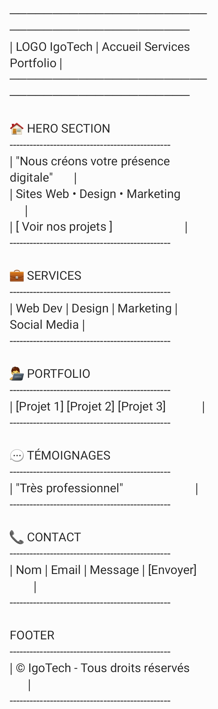

# MADJIYENGAR AXEL JOSEPH
# TRAVAIL PRATIQUE
---

# IgoTech - Portfolio Agence Digitale

---

# CAHIER DE CHARGE
Dans le cadre d'un travail pratique en Génie logiciel,il nous a été donné de mettre en place un portfolio pour l'entreprise de Technologie IgoTech.Dans ce cadre le site de publicité sera entièrement statique. Nous detaillérons beaucoup plus le travail dans les liens suivantes.
---

## Description
Projet de génie logiciel : création d’un site vitrine pour une agence digitale.

Développé uniquement en **HTML5 et CSS3**, sans JavaScript.

Architechure en couche : **1-tiers**

Les images insérées sont recuprées depuis le web via leur url

---

# Menus
- Accueil
  - Message d'accueil et une invitation à visiter le portfolio(projets)
- Services
  - Presentation des differents services
- Portfolio
  - Projets et temoignage
- Contacts
  - formulaire de contact

Chaque contenu d'un menu est une section bien spécifique et on y accède grace au id de navigation

---

## Objectifs
- Présenter les services de l’agence
- Montrer les projets réalisés
- Faciliter le contact client

---

## Technologies
- HTML5
- CSS3

---

##  Responsive Design
Le site est entièrement responsive :
- Desktop
- Tablette
- Mobile

---

## Maquette du projet
Voici la structure UX utilisée :

---

## 📁 Structure

/igotech_portfolio │── index.html │── /css/style.css │── Maquette.jpg

---

## Lancement
Ouvrir `index.html` dans un navigateur.

---

## 👨‍💻 Madjiyengar Axel Joseph
Projet réalisé dans un cadre de travail pratique de génie logiciel.